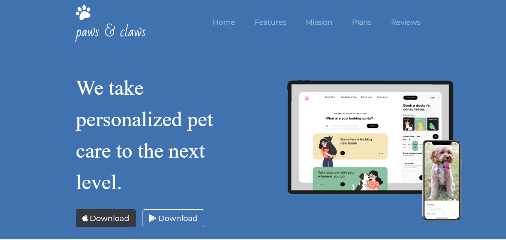
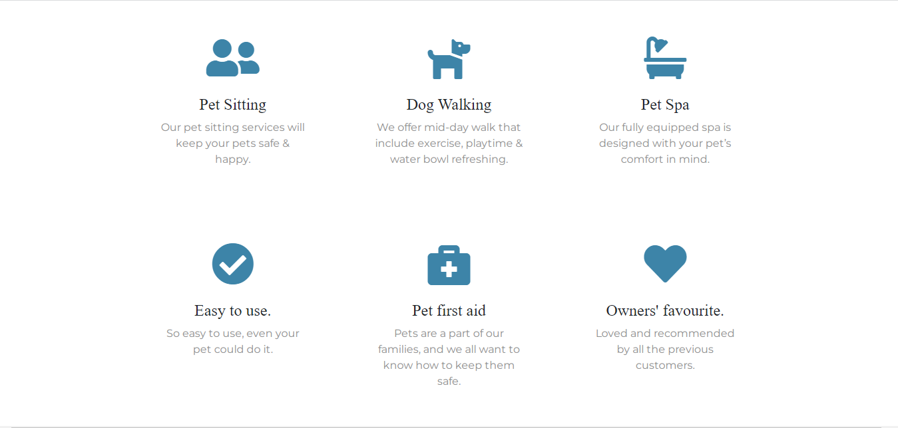
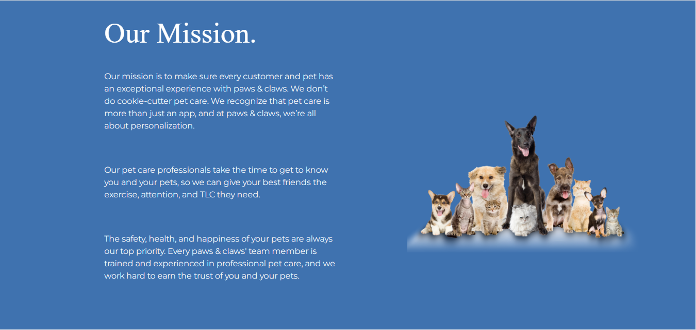
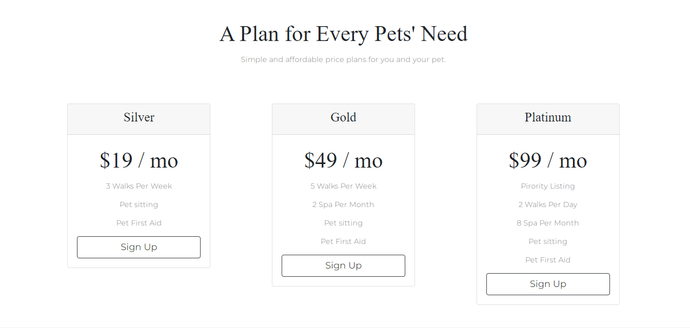
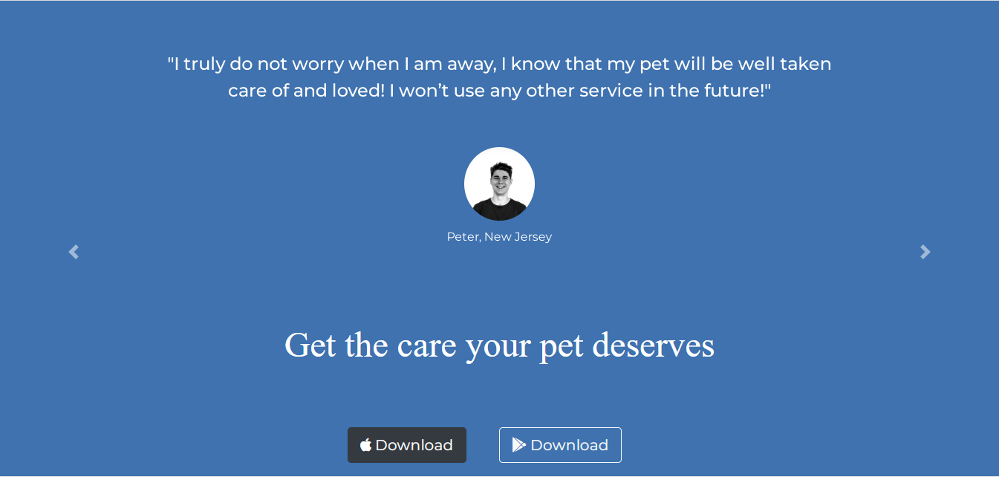

# Paws-Claws - A wonderfully weird group of pet Lovers

This is one of the projects for The Complete Web Development Bootcamp Course.

The Webpage focusses on implementing simple Web Development Using HTML and CSS.

This project is a template for penpals which is a static website.

## Snapshots:
###  Screenshot - 1 -

###  Screenshot - 2 -

###  Screenshot - 3 - 

###  Screenshot - 4 -

### Screenshot - 5 -

### Links

- Solution URL:  [Solution  URL](https://github.com/yashgjoshi20/Paws-Claws.git)
- Live Site URL: [GitHub Pages Live URL](https://yashgjoshi20.github.io/Pen-Pals/)

### Built with

- Semantic HTML5 markup
- CSS custom properties
- Flexbox
- CSS Grid
- Mobile-first workflow

For the website I've used the following resources:
* ***Icons***: [FlatIcons](https://www.flaticon.com/)
* ***Fonts***: [GoogleFonts](https://fonts.google.com/)
* ***Bootstrap***: [Bootstrap](https://getbootstrap.com/)
* ***External Packagers***: [NPM](https://www.npmjs.com/)

 ## Author

- GitHub - Yash Joshi (https://github.com/yashgjoshi20)
